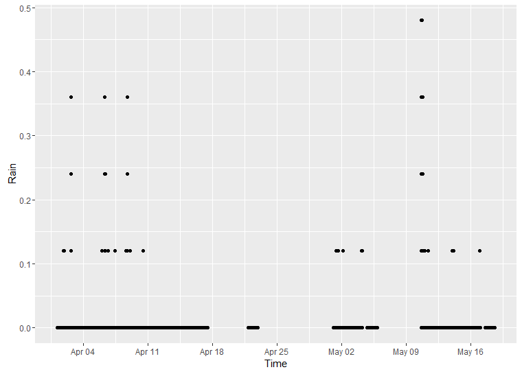

```{r setup, include=FALSE}
knitr::opts_chunk$set(echo = TRUE)
library(ggplot2)
library(knitr)
```

## Librarys

To execute this code, you need the following packages:

+ lubridate (to deal with datetime format information)
+ dplyr, tidyr, magrittr,wrapr (to deal with data manipulation)
+ RcppRoll (Efficient Rolling and windowed operation)

```{r, message=FALSE,warning=FALSE,results='hide'}
Libs=c('lubridate','dplyr','tidyr','magrittr','RcppRoll','wrapr')
lapply(Libs,library, character.only = TRUE)
```


## Load Sample data

Here is some sample data to demonstrate this code.

```{r Read sample data}
DtF=read.csv('https://raw.githubusercontent.com/ZyuAFD/SWRE_General_R_Functions/master/data/Sample_Precipitation.csv',
             sep=',',header=T,stringsAsFactors = F) %>%
    mutate(Time=ymd_hms(Time))


DtF %>% 
    arrange(Time) %>% 
    mutate(TimeLag_min=as.numeric(Time-lag(Time),units='mins')) %>% 
    group_by(TimeLag_min) %>% 
    tally %>% 
    rename(Num_lag=n) %>% 
    kable


# DtF %>%
#     ggplot()+
#     geom_point(aes(Time,Rain))

```



## Data Curation

1. Round each time point to the nearest 5 min time point (For example: 2015-05-01 12:44:20  ==> 2015-05-01 12:45:00)
2. Regulate the time interval to be consistent 5 min

```{r}
# Function for time regulation
source('https://raw.githubusercontent.com/ZyuAFD/SWRE_General_R_Functions/master/src/Regulate%205%20min.R')

# Define time interval (minute)
interval= 5 

DtF=Regular_Time(DtF,interval)

DtF %>% 
    arrange(Time) %>% 
    mutate(TimeLag_min=as.numeric(Time-lag(Time),units='mins')) %>% 
    group_by(TimeLag_min) %>% 
    tally %>% 
    rename(Num_lag=n) %>% 
    kable
```


## Event Separation

The function of event separation is shown below.
Parameters:

+ dt: Data frame including **Time** and **Rain** columns
+ IntE_P: Inter event dry period (See comments in code for detail)

```{r Event Separation}

#Precip Evt Separation function 

Precip_Evt_Sep= function(dt,T_intv,IntE_P)
    #dt:       data of time and rain
    #T_intv:   Time interval of the time series (mins)
    #IntE_P:   Inter event period 
    #           (time step based your time interval
    #            For example: in a 5 min time interval series
    #            a 4 hour inter event period is corresponding to
    #            48 for IntE_P)
    # output: 
    #   Odd Evt_lab: Rain event
    #   Even Evt_lab: Dry event
{
  #The header of time and rain should be
  # Time    Rain
  
    dt %<>% arrange(Time)
    
    # print out the gaps with NA Rain
    print('Here are all the gaps with NA rain.')
    dt %>% 
        filter(is.na(Rain)) %>% 
        arrange(Time) %>% 
        mutate(lag=as.numeric(Time-lag(Time),units='mins')) %>% 
        mutate(Gap_St=ifelse(lag>T_intv | is.na(lag),'Start','NA')) %>% 
        mutate(Gap_End=ifelse(lead(lag)>T_intv | is.na(lead(lag)),'End','NA')) %>% 
        mutate(Gap_Lab=(Gap_St=='Start')+(Gap_End=='End')) %>% 
        mutate(Gap_n=(cumsum(Gap_Lab)+1) %/% 2) %>% 
        group_by(Gap_n) %>% 
        summarise(Start=min(Time),
                  End=max(Time)) %>% 
        mutate(Duration_hr=as.numeric(End-Start,units='hours')) %>% 
        print
    
    #generate rain events

    data.frame(
        Time=c(min(dt$Time)-minutes(T_intv),
                max(dt$Time)+minutes(T_intv))
        ) %>% 
        bind_rows(dt) %>% 
        Regular_Time(T_intv) %>% 
        replace_na(list(Rain=0)) %>% 
        mutate(Cum_Precip_4hr_L=roll_sum(Rain,IntE_P+1,align='left',fill=0),
               Cum_Precip_4hr_R=roll_sum(Rain,IntE_P+1,align='right',fill=0)) %>% 
        mutate(St_wet=ifelse(lag(Cum_Precip_4hr_R)==0 & Rain>0,1,0),
               St_dry=ifelse(lag(Cum_Precip_4hr_L)>0 & Cum_Precip_4hr_L==0 & Rain==0,1,0)) %>% 
        replace_na(list(St_wet=0,St_dry=0)) %>% 
        mutate(Evt_lab=St_wet+St_dry) %>% 
        mutate(Evt_lab=cumsum(Evt_lab)) %>% 
        select(Time,Rain,Evt_lab) %>% 
        return
}
 
```


## Apply code

This is the pipe line of operation to generate rain events. The results included columns of:

1. Start:      Start time of event
2. End:        End time of event
3. TotalRain:  Total rain amount of event
4. Max_Int:    Maximium rain intensity of event (per time interval)
5. Dur_hr:     Event duration in hours

```{r,echo=FALSE}
source('https://raw.githubusercontent.com/ZyuAFD/SWRE_General_R_Functions/master/src/Preciptation_Event_Separation.r')
```

```{r Apply event separation function}
# inter event dry period time steps
IntE_P=48  # 4 horus: 48 time steps based on 5 min interval

DtF %>% 
    Precip_Evt_Sep(.,interval,IntE_P) %>% 
    filter(Evt_lab>0) %>% 
    group_by(Evt_lab) %>% 
    summarise(Start=min(Time),
              End=max(Time),
              TotalRain=round(sum(Rain),3),
              Max_Intensity=max(Rain), # Maximium rain intensity based on time interval
              Dur_hr=as.numeric(max(Time+minutes(5))-min(Time),units='hours')) %>% 
    mutate(PreDry_Dur_hr=lag(Dur_hr)) %>% 
        filter(TotalRain>0) %>% 
    kable(digits=3)
    
```

## Call function in your code
The sample code has been saved in this  [link](https://raw.githubusercontent.com/ZyuAFD/SWRE_General_R_Functions/master/src/Preciptation_Event_Separation.r) from Github. To use this code, embed the following code in to your R program.
```{r }
source('https://raw.githubusercontent.com/ZyuAFD/SWRE_General_R_Functions/master/src/Preciptation_Event_Separation.r')
```

To save the results into file, use the following code
```{r,eval=FALSE}
DtF %>% 
    Precip_Evt_Sep(.,interval,IntE_P) %>% 
    filter(Evt_lab>0) %>% 
    group_by(Evt_lab) %>% 
    summarise(Start=min(Time),
              End=max(Time),
              TotalRain=round(sum(Rain),3),
              Max_Intensity=max(Rain), # Maximium rain intensity based on time interval
              Dur_hr=as.numeric(max(Time+minutes(5))-min(Time),units='hours')) %>% 
    mutate(PreDry_Dur_hr=lag(Dur_hr)) %>% 
        filter(TotalRain>0) %>% 
    write.table(.,'path\\Filename.csv')
```

